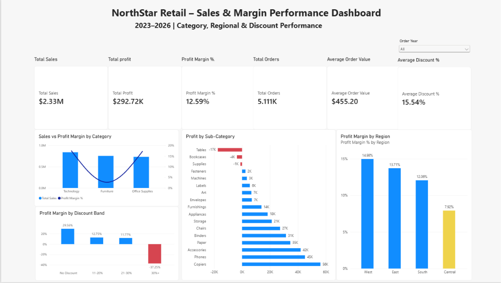

# NorthStar Retail - Sales & Margin Performance Analysis

## Overview

NorthStar Retail is a fictional retail business used to investigate a practical commercial problem:

> **The business is generating strong sales, but which areas are actually driving profit, and where is revenue failing to translate into healthy margins?**

This project analyses retail transaction data from **2023 to 2026** using **SQL Server and Power BI**.

The analysis focuses on product profitability, regional performance, customer segments, and discount effectiveness.

The main goal was to identify where management could improve profitability without simply focusing on increasing sales.

---

## Business Problem

NorthStar Retail generates sales across multiple product categories, regions, and customer segments.

However, sales alone do not provide a complete picture of business performance.

Management wants to understand:

1. **Where are sales and profit strongest or weakest?**
2. **Which categories, regions, or customer segments are underperforming?**
3. **Are higher discounts associated with lower profitability?**

The analysis therefore focuses on areas where **strong revenue is not translating into strong profit**.

---

## Executive Summary

NorthStar Retail generated approximately:

| KPI | Result |
|---|---:|
| **Total Sales** | **$2.33M** |
| **Total Profit** | **$292.7K** |
| **Profit Margin** | **12.59%** |
| **Total Orders** | **5,111** |
| **Average Order Value** | **$455.20** |
| **Average Discount** | **15.54%** |

Overall, the business is profitable, but performance varies significantly across products and regions.

Three areas stood out:

- **Furniture generates strong sales but weak profitability**
- **Heavy discounting is strongly associated with losses**
- **The Central region performs below the company-wide margin**

These findings suggest that NorthStar Retail has an opportunity to improve profitability by focusing on **margin quality, discount control, and underperforming product areas**.

---

# Sales & Margin Performance Dashboard

The Power BI dashboard provides a management-level view of:

- Total Sales
- Total Profit
- Profit Margin
- Total Orders
- Average Order Value
- Average Discount
- Category performance
- Sub-category profitability
- Regional performance
- Discount effectiveness
- Year-based filtering

*NorthStar Retail Sales & Margin Performance Dashboard*

---

# Key Findings

## 1. Furniture generates strong sales but weak profit

Furniture generated approximately **$754.7K in sales**, making it the second-largest category by revenue.

However, it produced only approximately **$20.1K in profit**, resulting in a profit margin of just:

> **2.67%**

By comparison:

- Technology margin: **17.45%**
- Office Supplies margin: **17.22%**

This showed that high Furniture sales were not translating efficiently into profit.

### Furniture Drill-Down

| Sub-Category | Sales | Profit | Margin |
|---|---:|---:|---:|
| Tables | $208.0K | **-$17.3K** | **-8.36%** |
| Bookcases | $115.4K | **-$3.6K** | **-3.15%** |
| Chairs | $335.8K | $27.2K | 8.11% |
| Furnishings | $95.6K | $13.9K | 14.53% |

The main profitability problem was concentrated in **Tables and Bookcases**.

Tables were the largest concern, generating more than **$208K in sales while producing approximately $17.3K in losses**.

---

## 2. Heavy discounting is strongly associated with losses

Discount performance showed a clear relationship between larger discounts and weaker margins.

| Discount Band | Sales | Profit | Margin |
|---|---:|---:|---:|
| No Discount | $1.11M | $326.7K | **29.56%** |
| 11-20% | $82.5K | $10.5K | 12.75% |
| 21-30% | $773.9K | $91.1K | 11.77% |
| 30%+ | $364.8K | **-$135.6K** | **-37.25%** |

Transactions discounted by **30% or more** still generated substantial revenue, but collectively produced approximately:

> **$135.6K in losses**

This does not prove that discounting alone caused the losses, but it shows a strong association between **heavy discounting and poor profitability**.

### Tables and Discounting

Because Tables were the largest loss-making Furniture sub-category, I analysed them separately.

| Discount Band | Sales | Profit | Margin |
|---|---:|---:|---:|
| No Discount | $71.7K | $13.3K | **18.60%** |
| 21-30% | $45.6K | -$0.3K | **-0.65%** |
| 30%+ | $90.7K | -$30.4K | **-33.76%** |

Tables sold without discounts were profitable, while heavily discounted Tables generated significant losses.

---

## 3. Central is the weakest-performing region

Regional performance also varied significantly.

| Region | Sales | Profit | Margin |
|---|---:|---:|---:|
| West | $739.8K | $110.8K | **14.98%** |
| East | $691.8K | $94.9K | **13.71%** |
| South | $391.7K | $47.2K | **12.06%** |
| Central | $503.2K | $39.9K | **7.92%** |

The Central region generated more than **$503K in sales**, but its profit margin was only:

> **7.92%**

This was significantly below the company-wide margin of **12.59%**.

Further analysis found that:

> **Central Furniture recorded a -1.70% profit margin**

This suggests that Furniture performance is one of the factors contributing to Central's weaker profitability.

---

## 4. Consumer is the largest segment, but not the most margin-efficient

| Segment | Sales | Profit | Margin |
|---|---:|---:|---:|
| Home Office | $440.1K | $61.7K | **14.02%** |
| Corporate | $715.8K | $94.7K | **13.24%** |
| Consumer | $1.17M | $136.4K | **11.65%** |

The Consumer segment generated the highest sales and total profit.

However, it also recorded the lowest profit margin of the three customer segments.

This reinforces an important finding from the analysis:

> **Higher revenue does not always mean better commercial performance.**

---

# Key Insights & Recommended Actions

The second Power BI page summarises the most important findings and turns them into practical management actions.

*Key Insights & Recommended Actions*

---

## Recommended Actions

### 1. Review Furniture profitability

Management should prioritise **Tables and Bookcases**, with particular attention to:

- Pricing
- Product mix
- Discount levels
- Individual loss-making products

Furniture performance should be monitored using **profit margin alongside sales**, rather than revenue alone.

---

### 2. Review heavy discounting

Discounts of **30% or more** should receive greater management attention.

Potential actions include:

- Introducing discount approval thresholds
- Reviewing margin before large discounts are applied
- Testing smaller promotional discounts
- Monitoring profitability by discount level

The objective is not necessarily to eliminate discounting, but to ensure promotions generate **profitable sales**.

---

### 3. Investigate Central-region performance

Management should review Central's:

- Product mix
- Furniture performance
- Discounting behaviour
- Pricing decisions

Performance could also be compared with stronger regions such as **West and East** to identify practices that may help improve Central's margin.

---

# Management Priority

> ## Protect margin before chasing additional revenue.

The clearest opportunities identified in this analysis are:

1. **Improve Furniture profitability**
2. **Reduce losses associated with excessive discounting**
3. **Address Central-region underperformance**

NorthStar Retail already generates significant sales.

The stronger opportunity is to improve the **quality and profitability of those sales**.

---

# Conclusion

NorthStar Retail is profitable overall, but the analysis shows that **high sales do not always translate into healthy margins**.

Furniture, particularly Tables and Bookcases, represents the clearest product profitability concern.

Heavy discounting is strongly associated with significant losses, while the Central region substantially underperforms stronger regions on margin.

The project demonstrates how transactional data can be used to move from **business KPIs to deeper analysis, interactive reporting, and practical management recommendations**.

---
